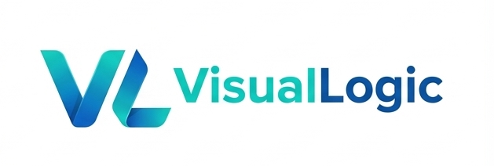

  

# VisualLogic.ai

> An AI-native programming system based on VL (Visual Logic),
> where Language ⇄ Graph ⇄ AI Agents are fully reversible.

  <a href="https://editor.visuallogic.ai/" style="font-size: 16px; color: #007bff;">🌐 Website</a> |
  <a href="https://www.youtube.com/playlist?list=PLJE6c8wBknRnCZIRv_VFa1dYswTSqoW21" style="font-size: 16px; color: #ff0000;">🎥 YouTube Playlist</a> |
  <a href="https://discord.com/invite/KdaVtR7pzv" style="font-size: 16px; color: #7289da;">💬 Discord Community</a>

---

## 🚀 What is VisualLogic?

VisualLogic is a **full-stack AI programming system** built on a minimal, deterministic language called **VL (Visual Logic)**.

It enables:

- Natural language → full application generation
- Massively parallel multi-agent code generation
- True bidirectional transformation between code and visual graphs
- Deterministic AI output with ultra-low token cost

Unlike traditional low-code, no-code, or prompt-based systems:

> **VisualLogic is not a tool on top of code.  
> VisualLogic *is the programming system itself*.**

---

## 🧠 Core Architecture
Natural Language
 ↓
 AI IDE (Agents + Workflow + Prompt Center)
 ↓
 VL Files (.vx .vv .vs .vdb)
 ↓
 Graphic IDE (Visual Programming & Debug)
 ↓
 VL Compiler
 ↓
 JS + Java / Node Full Stack Code

 
---

## 🧬 VL Language (Open Standard)

VL is a deterministic, low-entropy programming language optimized specifically for AI:

- Stable grammar
- No hidden state
- No formatting ambiguity
- Massive agent parallelism
- Ultra low token cost per generation

VL acts as the **intermediate representation (IR)** between:

- AI Models
- Visual IDE
- Real production code

> The Visual IDE is the 2D projection of VL.  
> The VL text is the 1D projection of the visual IDE.

---

## 🧩 Component-Oriented Programming

Everything in VisualLogic is a component:

- UI Components  
- Service Components  
- Database Components (VirtualTables)  
- Workflow Components  
- Agent Components  

This allows:

- True full-stack visual programming
- Unified logic across frontend, backend, and data
- AI-friendly structured generation

---

## 🤖 AI IDE + Workflow System

VisualLogic embeds a full workflow engine inside the AI IDE:

- Each Agent is configurable
- Each Agent uses Prompt IDs from a Prompt Document Center
- The entire Agent Workflow is defined as a JSON file
- The JSON itself can be generated and optimized by AI

This enables:

- Self-evolving AI development pipelines
- Human-in-the-loop debugging
- Deterministic multi-agent collaboration

---

## 🛠 Compiler & Runtime

VisualLogic provides:

- Online cloud compiler
- Local offline compiler
- Full-stack output:
  - Frontend: JavaScript
  - Backend: Java / Node
- Independent deployment

---

## 🌍 Open Source Strategy

VisualLogic follows a **layered open-source strategy**:

| Layer | Open Status |
|------|-------------|
| VL Language Spec | ✅ Open |
| VL Grammar & Parser | ✅ Open |
| VL ⇄ Graph Mapping | ✅ Open |
| AI Optimization Patches | ❌ Closed |
| AI IDE | ❌ Closed |
| Graphic IDE | ❌ Closed |
| Cloud Compiler | ❌ Closed |

---

## 📚 Who Is VisualLogic For?

- AI-native developers
- System architects
- Enterprise engineering teams
- Researchers in AI programming languages
- Low-code / No-code platform builders

---

## 🔗 Website

https://editor.visuallogic.ai

---

## ⭐ Vision

> The future of programming is not typing code.  
> The future is AI + deterministic language + visual systems.
